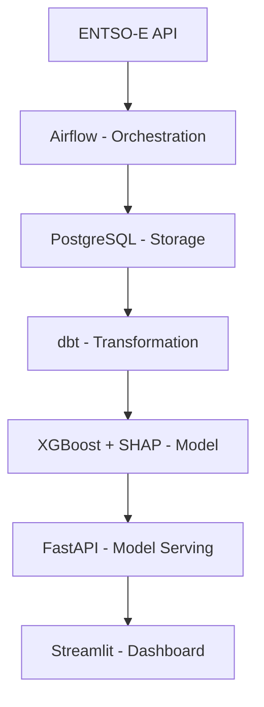

# BE Smart Energy Consumption

## The Problem
Electricity prices in Belgium change every hour and depend heavily on how much 
renewable energy is available in the grid. When wind and solar are high, prices 
drop. When demand peaks, prices surge. But consumers and businesses have no 
visibility of this in advance — they pay whatever price the hour brings.

## The Solution
An end-to-end data pipeline that ingests real-time energy data from ENTSO-E, 
predicts hourly electricity prices for the next 24 hours, and explains **why** 
prices will be high or low — so consumers can make smarter decisions about 
when to consume energy.

## Who Is This For?
- **Households** with electric vehicles or high-consumption appliances
- **Small businesses** that can shift energy-intensive operations
- **Energy analysts** who need explainable price forecasts

## Key Features
- Hourly price forecast for the next 24 hours
- Explanation of price drivers (renewable generation, demand levels)
- Optimal consumption window recommendations with estimated savings
- REST API for integration with third-party applications

## Architecture


## Tech Stack
LAYER : TECHNOLOGY

- Orchestration : Apache Airflow 
- Storage : PostgreSQL
- Transformation : dbt 
- ML Model : XGBoost + SHAP 
- API : FastAPI 
- Dashboard : Streamlit 
- Infrastructure : Docker Compose 
- Data Source : ENTSO-E Transparency Platform 

## Project Structure
```
be-smart-energy-consumption/
│
├── docker/
│   ├── airflow/
│   │   └── Dockerfile
│   ├── fastapi/
│   │   └── Dockerfile
│   └── streamlit/
│       └── Dockerfile
│
├── dags/
│   └── energy_pipeline.py
│
├── ingestion/
│   ├── __init__.py
│   └── entsoe_client.py
│
├── dbt/
│   ├── models/
│   │   ├── staging/
│   │   ├── intermediate/
│   │   └── mart/
│   ├── tests/
│   └── dbt_project.yml
│
├── api/
│   ├── main.py
│   ├── routers/
│   │   ├── forecast.py
│   │   ├── recommendation.py
│   │   └── explanation.py
│   └── schemas/
│       └── response.py
│
├── ml/
│   ├── train.py
│   ├── predict.py
│   └── explainer.py
│
├── dashboard/
│   └── app.py
│
├── docker-compose.yml
├── .env
├── requirements.txt
└── README.md
```

## Getting Started
```bash
git clone https://github.com/srozada/be-smart-energy-consumption.git
cd be-smart-energy-consumption
cp .env.example .env  # add your ENTSO-E API key
docker-compose up
```

## API Endpoints
ENDPOINT : DESCRIPTION

- GET /health : API status 
- GET /forecast : Hourly price forecast for next 24h 
- GET /recommendation : Optimal consumption windows 
- GET /explanation : Price driver explanation per hour 

## Project Status
In active development

## Roadmap
- [x] Project structure
- [ ] Data ingestion pipeline
- [ ] dbt transformation models
- [ ] XGBoost forecasting model
- [ ] SHAP explainability layer
- [ ] FastAPI deployment
- [ ] Streamlit dashboard
- [ ] Cloud deployment (Railway)